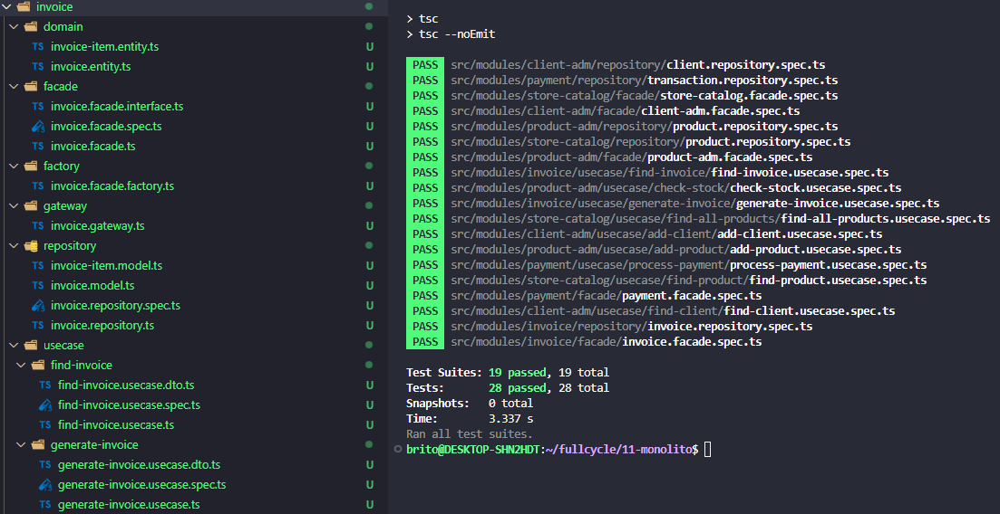
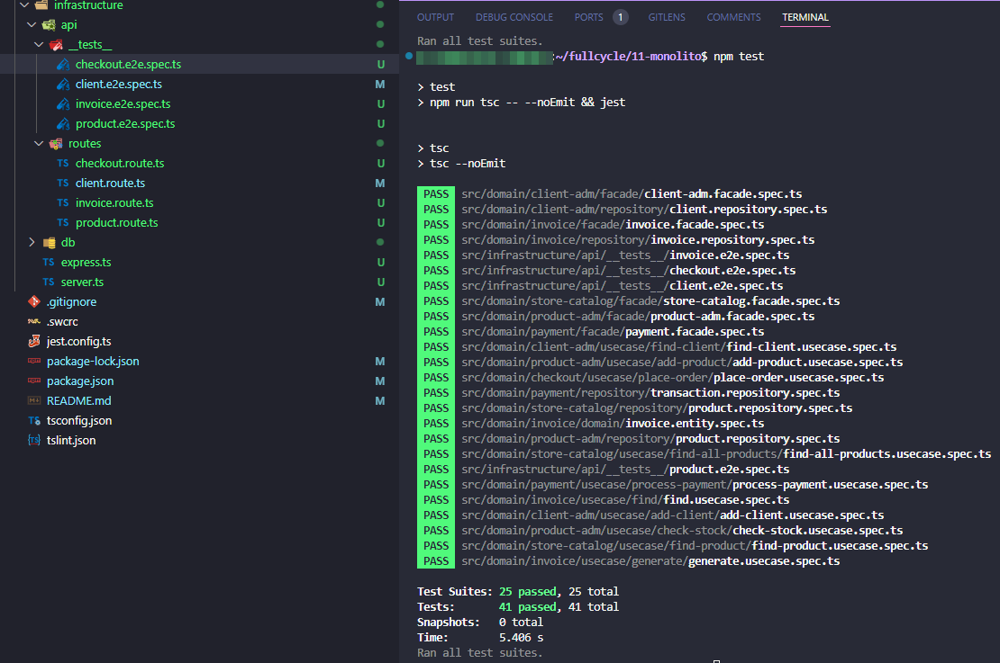

# Full Cycle 3.0 - Sistemas monolíticos

## Challenges:

### 1 - Criação de módulo de Invoice:

- Neste desafio será necessário criar o módulo completo de invoice - Nota Fiscal do Monolito.
- Para este módulo você precisa utilizar:
  - Os use cases de find e generate
  - Especificar todas as entradas e saídas conforme o DTO exibido ao final deste enunciado.

### 2 - Criação de API

- Agora que temos todos os usecases, precisamos disponibilizar os endpoints para que possamos realizar uma compra.
- Disponibilize os seguintes endpoints:

  - POST /products
  - POST /clients
  - POST /checkout/
  - GET /invoice/id

- A linguagem de programação para este desafio é TypeScript
- Implemente os testes end-to-end destes endpoints com a lib supertest, ao rodar o comando "npm run test" a aplicação deve executar todos os testes. Se tiver dúvidas de como usar o supertest acesse o módulo de Clean Arch no módulo Camada de API.

